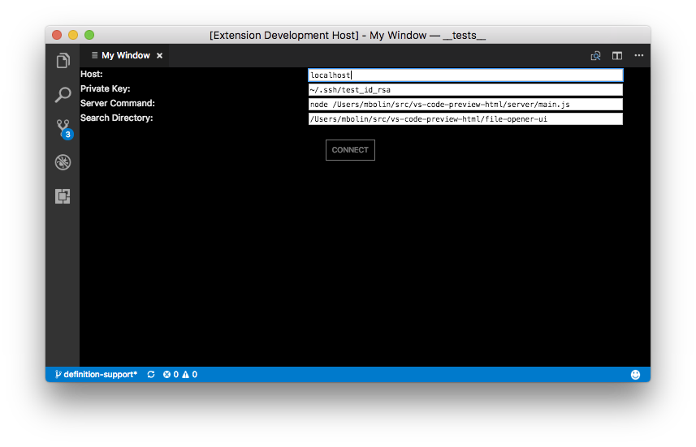
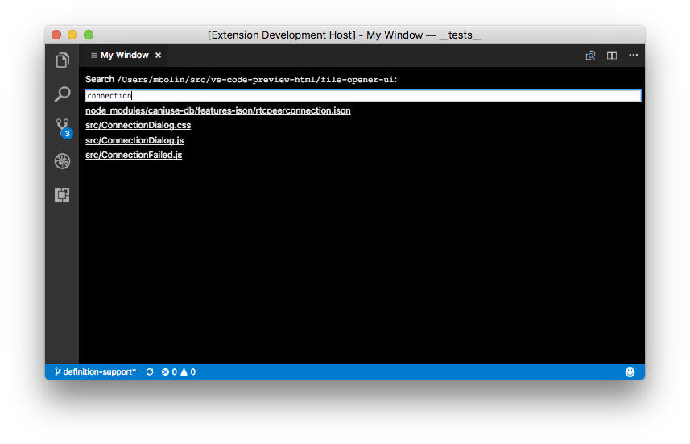

# vscode-big-dig-remote-file-demo

This is a demo to see what is possible with respect to extending VS Code to
support remote file editing.

## How It Works

The goal of this extension is to simulate connecting to a remote directory,
using a fuzzy search to find files in that directory, and then open them for
reading in VS Code. (Ideally, it would be for editing, but that is going to be
a separate demo that requires ExpanDrive.)

To introduce the UI for the remote connection dialog and fuzzy search, we use
the technique introduced by the [vs-code-preview-html](https://github.com/bolinfest/vs-code-preview-html)
demo that uses the `vscode.previewHtml` API for rendering and a WebSocket for
communicating between the host extension and the UI.

To connect and communicate with a remote server, we use the
[Big Dig](https://www.npmjs.com/package/big-dig) library. (Note that the server
must run on some sort of *nix system because it runs `/usr/bin/find`.)
This starts a remote server that supports two RPC methods named `do-file-search`
and `get-file-contents` that are used by the fuzzy search UI.

## Developing This Extension

In addition to the normal `npm install` stuff, you must also run
`file-opener-ui/build-extension-ui.js` when building the extension for the
first time and any time you make a change in the `file-opener-ui` directory.

For testing, it is easiest to use `localhost` as your "remote host." You will
also need a public/private key pair, so we recommend creating a special one for
testing that does not require a passphrase to avoid getting prompted for the
passphrase while testing:

```
ssh-keygen -f ~/.ssh/test_id_rsa -q -N ''
cat ~/.ssh/test_id_rsa.pub >> ~/.ssh/authorized_keys
```

Once you have created this key pair and stored it in `~/.ssh/authorized_keys`,
now you can run the extension in debug mode just like any other extension.

## Running The Extension

Once you have created `~/.ssh/test_id_rsa` as described above and you have the
extension installed, choose `Big Dig remote file opener demo` from the command
palette, which will open the connection dialog in its own tab. The default
values should work, but you are free to change them if you need to:



You can hit enter or click the **CONNECT** button to connect. Assuming the
connection is successful, you should be able to type a file name into the text
box and click on the search results to open the files and see their contents:



Note that the search logic is extremely simple and inefficient because this is
just a demo, so don't be surprised if it isn't very responsive.

## Using a True Remote Connection

If you are interested in connecting to a machine that is *actually* remote,
check out the source code for this extension on a remote machine and run
`npm install`. You will have to modify the inputs to the connection dialog as
follows:

* Change the **Host** to the hostname of your remote machine.
* Change **Private Key** to point to the key you normally use to connect to that machine (most likely, this is `~/.ssh/id_rsa`).
* Modify **Server Command** to refer to the absolute path of `vs-code-preview-html/server/main.js` on the remote machine.
* Change the **Search Directory** to the directory on the remote machine that you wish to search.

With the dialog properly populated, you should be able to connect and search
just as you did with `localhost`. Note that if your remote server requires you to
2fac, the extension will provide the appropriate prompt.

## Troubleshooting

Instead of specifying `node` as the executable in the Search Command,
you may need to specify the absolute path to it, such as `/usr/local/bin/node`.
