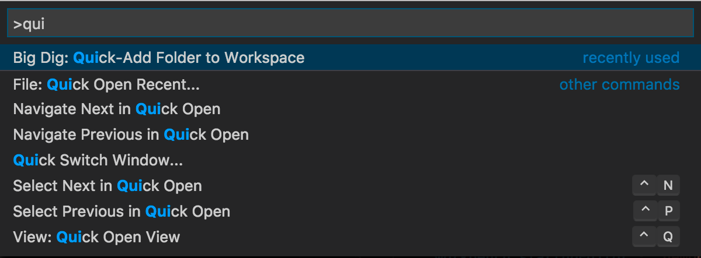
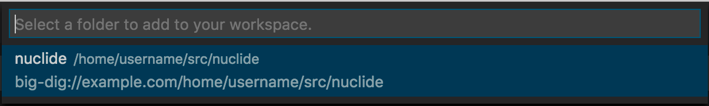

# Big Dig for VS Code

`big-dig-vscode` is a VS Code extension that facilitates developing code on a
remote host using VS Code. It relies on [Big
Dig](https://github.com/facebook/nuclide/tree/master/modules/big-dig) to
transport information between the local and remote hosts. Be sure to verify that
the host you want to connect to [has the required tools installed for Big
Dig](../big-dig/#history) (Node, Watchman, etc.).

## Building the Extension

Currently, the only way to use the extension is to build it from source because
the extension uses [proposed
APIs](https://github.com/Microsoft/vscode/blob/master/src/vs/vscode.proposed.d.ts),
so it cannot be published in the [VS Code Extension Marketplace](
https://marketplace.visualstudio.com/VSCode) today. (Over time, as these
proposed APIs are frozen and promoted to official APIs, we should be able to
publish an official version of the extension.)

Run the following commands to build the extension from source:

```sh
$ git clone https://github.com/facebook/nuclide.git
$ cd nuclide
$ yarn --pure-lockfile  # Requires yarn 1.7.0 or later.
$ cd modules/big-dig-vscode
$ yarn vsix
```

Because proposed APIs are a "moving target," we only test the extension for use
with a specific version of the [VS Code Insiders
](https://code.visualstudio.com/insiders/) build. Currently (as of 2018-07-10),
the extension has been tested with the `2018-05-08T05:05:13.439Z` Insiders
build, which is admittedly quite far behind. We hope to update it soon. (Note
that, by default, the Insiders build updates itself nightly. If you want to
disable this behavior, you must add `"update.channel": "none"` to your
`settings.json`.)

For convenience, we include a script to launch VS Code Insiders with the
extension on a Mac (it should be straightforward to tweak this for another
platform):

```sh
$ ./scripts/mac-insiders-dev
```

## Using the Extension

Once you have launched Insiders with the extension, you need to add some details
about the host(s) you want to connect to in your `settings.json`. Note that
`"big-dig.connection.profiles"` is an array that can contain multiple entries
(one per host):

```json
"big-dig.connection.profiles": [
    {
        "hostname": "example.com",
        "folders": [
            "/home/username/src/nuclide",
            // You can list more folders here.
        ],
        // Port range over which the host can serve HTTP traffic.
        "ports": "9000-9999",
    },
],
```

Once you have set `"big-dig.connection.profiles"` in `settings.json`, choose
**Big Dig: Quick-Add Folder to Workspace** from the command palette:



Once you select it, you should see the folder(s) you specified in
`settings.json`:



Upon selecting the folder, the extension will try to connect to the host and add
the specified folder as a workspace root in VS Code. Because the initial
connection is done via SSH, you will get prompted to authenticate as you would
if you ran `ssh` from the command line.

Upon successful connection, you should be able to browse the file tree for your
remote directory as you would if it were a local directory in VS Code.
Similarly, `ctrl-p` (`cmd-p` on Mac) can be used to search for a remote file,
just as it would for a local file.

### Text Search

VS Code's built-in text search UI will search the remote filesystem so long as
[ripgrep](https://github.com/BurntSushi/ripgrep) (`rg`) is available on the
remote host.

### Remote Terminal

Right-click on any folder in the File Tree and choose **Open in Terminal**. You
will get a terminal to the remote host whose working directory is the one you
right-clicked on in the File Tree.

One special feature in this terminal is a built-in `code` executable that is
available on your `$PATH` that takes a file on your remote host as an argument
and opens it in Insiders.

### Mercurial Integration

If the remote folder you connected to is part of a Mercurial repository and you
have `hg` available on the remote host, then Big Dig will communicate the
current state of your Mercurial repo via [VS Code's Source Control
integration](https://code.visualstudio.com/docs/extensionAPI/api-scm).

### Language Services

If the remote folder (or one of its ancestors) contains a file named
`.bigdig.toml`, then the extension will try to parse it and load any language
servers it defines. For example, Nuclide's `.bigdig.toml` includes the following
content:

```toml
[lsp]

  [lsp.flow]
  language = ["javascript"]
  command = "flow"
  args = ["lsp", "--from", "big-dig", "--lazy-mode", "ide"]
```

Upon connection, Big Dig will launch the LSPs specified in `.bigdig.toml` and
proxy the communication between your local Insiders and the conforming LSP
server running on the remote host. The net effect is an editing experience with
full language support that feels like it is local!

### Remote Debugging

This feature is still under active development. If you want to play around with
it, you will need to add something like the following to your `.bigdig.toml` to
configure a remote debugger:

```toml
[debugger]

  [debugger.hhvm]
  language = ["php"]
  command = "node"
  args = ["/home/username/src/nuclide/pkg/nuclide-debugger-hhvm-rpc/lib/hhvmWrapper.js"]
  request = "attach"
```

If you get the configuration right, you should be able to hit `F5` in Insiders
and choose **Remote Debugging** to attach the specified debugger.
