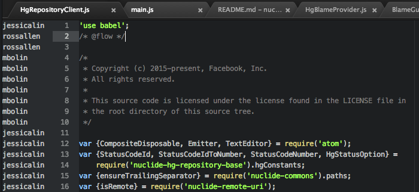

# nuclide-blame

Displays source control blame.



## Prerequisites

The `nuclide-blame` feature requires at least one "blame provider" that
fetches blame information.

Nuclide currently provides the `nuclide-blame-provider-hg` feature, which
can fetch blame for files within Mercurial repositories. To support other types
of source control, you would need other blame providers.

## How to Use

To open blame, right-click in the body of an editor to open the context menu,
then select 'Toggle Blame'. 'Toggle Blame' will only be visible if you have a
blame provider installed that can provide blame for the file in that editor.
To remove blame, open the context menu as above, and select 'Toggle Blame'
again.

## How to Write a Blame Provider

See the `nuclide-blame-provider-hg` Nuclide feature as an example. A blame provider
package should provide a service called `"nuclide-blame-provider"` through the Atom
service hub. This service should return a provider Object that implements the
following methods:

```js
/**
 * @return Whether the provider can provide blame information for the specified TextEditor.
 */
canProvideBlameForEditor(editor: TextEditor) => boolean

/**
 * @return Map where the keys are 0-indexed TextBuffer line numbers, and values are blame.
 */
getBlameForEditor(editor: TextEditor) => Promise<Map<number, string>>
```

It should also implement the following method, so long as it has a non-trivial implementation:

```js
/**
 * Tries to find a URL that contains more information about the revision. If no such URL exists,
 * returns null.
 */
getUrlForRevision: (editor: TextEditor, revision: string) => Promise<?string>
```
