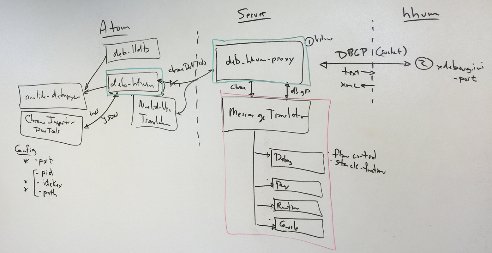

# PHP Debugger Design

The PHP debugger enables debugging of remote PHP processes from Nuclide. The nuclide debugger uses the [Chrome dev tools debugger protocol](https://developer.chrome.com/devtools/docs/protocol/1.1/index), while PHP uses the [Dbgp protocol](http://xdebug.org/docs-dbgp.php).
 The main goals of the PHP debugger are remoting messages to the Nuclide server machine, and translating message between the two protocols.

## debugger-php

The debugger-php package runs inside atom. It provides the connection information to the attach UI in nuclide-debugger. Upon initiating a connection, it uses the Nuclide remote service-transformer to create a PhpDebuggerService on the server. After connection it relays Chrome messages between the Nuclide debugger UI and the PhpDebuggerService. The Nuclide debugger UI also runs in the atom process and communicates with the debugger-php package over a web socket.

As part of this message relay the debugger-php package translates all file URIs in the messages to/from Nuclide remote URI's.

### Connection information

Dbgp connections may be filtered on a combination of pid, idekey and script path. pid is process id. idekey is usually the user's user id. The idekey and path are surfaced as configuration options of the debugger-php package which are editable via the atom Preferences UI.

## debugger-php-rpc - PhpDebuggerService

The debugger-php-rpc package runs on the server. It initiates the Dbgp connection and translates messages between the two protocols. The debugger-php-rpc exposes the PhpDebuggerService. The PhpDebuggerService initiates the Dbgp connection, and translates messages between the Dbgp and Chrome protocols.

### Establishing the Dbgp Connection

The Dbgp connection is described in detail [here](http://xdebug.org/docs-dbgp.php#initiating-a-debugging-session). The connection is started by the proxy listening on a socket. PHP instances will attempt connect to the socket whenever they begin a new script. After connecting to the socket, PHP sends an initialization packet including pid, idekey, and script path. The proxy may decide to filter connections on any of these 3 values. If the connection does not pass the filter, the proxy closes the connection and continues waiting for a connection which passes the filter. If the connection passes the filter, then the proxy stops listening for new connections and debugging commences.

### Protocol Translation

The MessageTranslater translates messages between the Chrome and Dbgp protocols. It divides the task into a number of Handlers - Debugger, Page, Console, Runtime. Each handler deals with a single Domain in the Chrome protocol.
