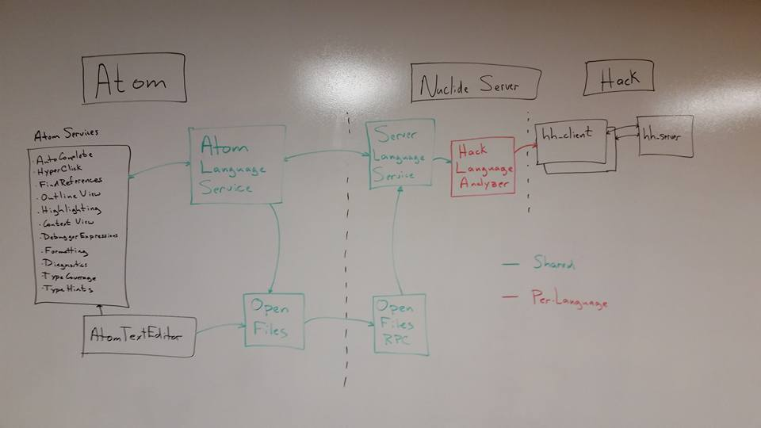

# Nuclide Language Service: Design

## Stage 1
### Goals
- Reduce cost of adding new languages
- Establish best practices
- Reduce per-keystroke RPC traffic

### Design

### Using `FileVersion` and `getBufferAtVersion` For File Contents

Most of the APIs in the `LanguageService` interface require a file name and the contents of the file
to perform their operation. Including the entire file contents in each language service request would
be extremely inefficient. Instead, the current file state is sent in a `FileVersion` object.

The `FileVersion` object just contains the file name, version number and notifier. We'll come back
to the notifier in a bit. Note that the version number is internal to the Atom process. Each time
the file is edited (on each keystroke) in the Atom process the version number is incremented.

The `getBufferAtVersion` function in the `nuclide-open-files` package maps from a `FileVersion`
to an Atom compatible `TextBuffer`. This `TextBuffer` is a copy of the one in the Atom process.
It can be used to access the current file contents, map from Atom `Point` and `Range` objects to and
from the file contents. See the documentation at http://atom.io for details.

When the user types several characters in quick succession each character will send an edit to the
server. The first character will likely invoke language service APIs (in particular for
`getAutocompleteSuggestions`). As the autocomplete request is processed, there is a race between the
later edits and the `getBufferAtVersion` call made by autocomplete implementation. If the edit wins
the race the `getAutocompleteSuggestions` will make a request for an outdated version of the file.
When this occurs `getBufferAtVersion` will throw. Just let this exception propagate to the caller
as the request is outdated as well and a later request will come for the newer buffer version.

### AtomLanguageService

The `AtomLanguageService` class lives in the Atom process and handles all registration of Atom services including:
- autocomplete
- hyperclick
- find references
- outline view
- highlights
- definition Service
- debugger expressions
- formatting
- diagnostics
- type coverage
- type hints

The `AtomLanguageService` class takes a config object describing which language service features are
supported, as well as a factory which creates a `LanguageService` interface for a given RPC ServerConnection.

For each request from an Atom service, the `AtomLanguageService` uses the `getFileVersionOfEditor` in the
 `nuclide-open-files` package to get a `FileVersion` and forwards all requests to the
 `LanguageService` RPC interface on the server.

### ServerLanguageService

The `ServerLanguageService` implements the `LanguageService` RPC interface and lives in the
Nuclide Server process. It receives all calls from the `AtomLanguageService`, maps from `FileVersion`
back to NuclideUri and atom$TextBuffer using the `getBufferAtVersion` API from `nuclide-open-files-rpc`.
Then it forwards the request to the language specific `SingleFileLanguageService`. If the request is stale,
meaning the buffer is older than the requested version, then the request is aborted.

To implement a new language an implementation of the `SingleFileLanguageService` interface must be provided.
This interface does not need to be aware of the RPC layer or the file synchronization protocol.
All requests to the `SingleFileLanguageService` interface use atom$TextBuffers to communicate current editor
contents.

## Stage 2
### Goals
- enable analysis to reflect user's view of all open files
- enable instant diagnostics without saving
- Reduce per-keystroke traffic to language analyzer
- push based busy signal notifications

### Design

To achieve these goals, the language analyzer must be kept apprised of the current state of all open
files which can effect a language analysis operation. Rather than sending the contents of all edited
files on each operation, a persistent connection is established with the language analyzer and the
status of open files are proactively sent to the analyzer as the file is edited.

TODO Add Picture ...

### Observable File Events

The `nuclide-open-files-rpc` package also provides `observeFileEvents()` an observable stream of
file open/edit/close events. This is routed to the persistent language analyzer to keep it up to
date on all file edits.

Rather than sending the current file contents in each language analysis request, a file path and
version can be used for requests to the persistent connection.

Once the persistent connection is established, the language analyzer can push diagnostic updates
as soon as they are ready, rather than having the Nuclide code guess when to request diagnostics.
This enables significantly quicker diagnostic response, in particular for syntax errors.

- TODO: push based busy-signal
