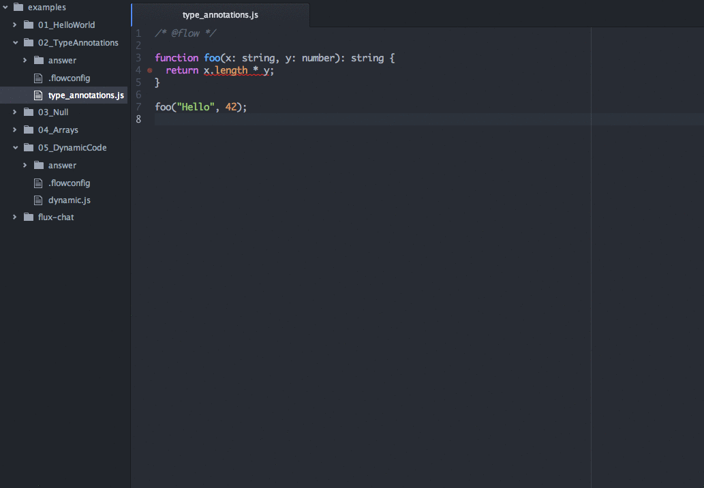
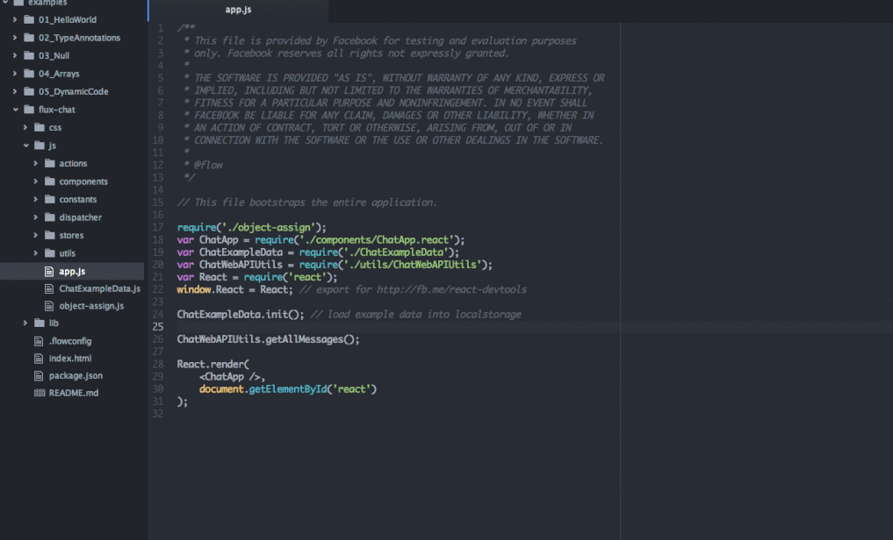

# Flow

This feature provides integration with [Flow](http://flowtype.org/), a static
type checker for JavaScript.

It requires that Flow is already present on your system. Follow [these
instructions](http://flowtype.org/docs/getting-started.html) to install Flow
if you do not already have it. Unfortunately Flow currently has [no Windows
support](https://github.com/facebook/flow/issues/6), so this feature will not
work on Windows.

This is what you need to do to get Flow working on your system:

* Install Flow.
* Make sure `flow` is on your `$PATH`, or specify the path to the `flow` binary
  in the settings for the 'nuclide-flow' feature in the 'nuclide' package.
  * Please note that changes to your `$PATH` made in your `.bashrc` will not be
    made available to Atom unless you start it from the command line.
  * In particular, if you unzip the `flow.zip` file to your home directory, you
    will probably need to explicitly specify the path to the `flow` binary in
    the settings for the 'nuclide-flow' feature in the 'nuclide' package.
  * For some context, this has been a longstanding source of confusion.
    * Here is a [relevant linter
      issue](https://github.com/AtomLinter/Linter/issues/150).
    * Here is another [solution](http://serverfault.com/a/277034) that allows
      the `$PATH` to be changed for all applications (launched from the command
      line and the GUI) in OS X.
* Create a `.flowconfig` file in the root of your project (this can be empty).
* Add `/* @flow */` to the top of JavaScript files that you want checked.

Visit the [Flow page](http://flowtype.org/) for more detailed instructions.

# Overview

* Shows Flow errors inline
* Provides Flow-drive inline autocomplete
* `cmd-click` on a symbol jumps to its definition
* Hovering over an expression exposes its type

# Examples

This feature shows Flow errors inline:

This feature also integrates click to symbol with Flow, so a `cmd-click` on a
symbol will jump to its definition.

