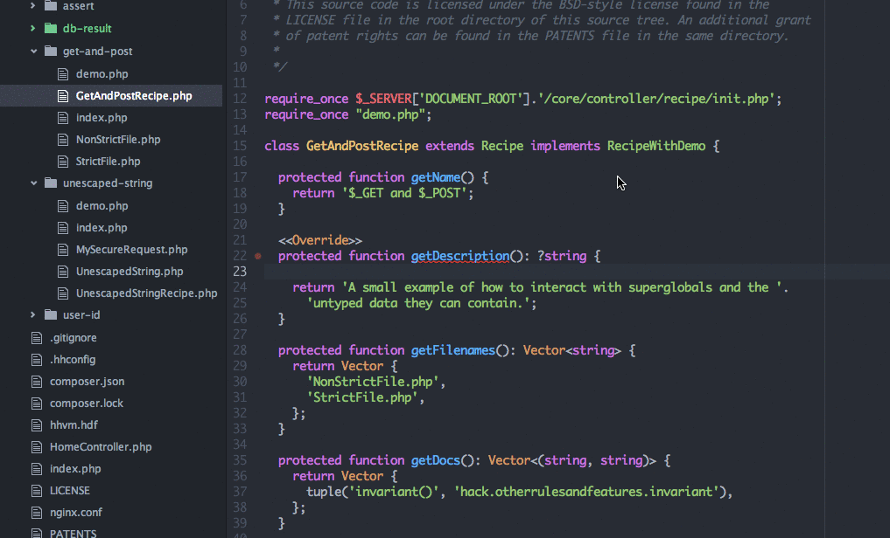
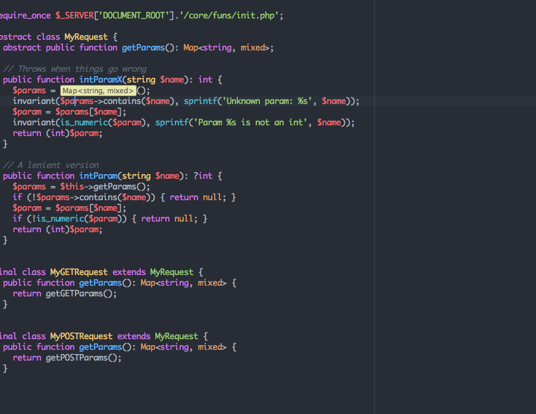

# Hack

This feature provides language features integration with [Hack](http://hacklang.org/), a programming
language for [HHVM](http://hhvm.com/) including, Linter, Autocompletion, Go to definition, Type Hint
on mouse hover and Code Format.

To get the most of it, HHVM should be installed on your system.
Follow [Linux instructions](https://github.com/facebook/hhvm/wiki/Getting-Started)
or [MacOSX instructions](https://github.com/facebook/hhvm/wiki/building-and-installing-hhvm-on-osx-10.9)
to install HHVM if you do not already have it. Unfortunately HHVM currently has [no Windows
support](https://github.com/facebook/hhvm/issues/5460).
This feature will have limited functionality on Windows and if you don't have HHVM installed.

This is what you need to do to get Hack language features working on your system:

* Install HHVM.
* Make sure `hh_client` is on your `$PATH`
* Create a `.hhconfig` file in the root of your project (this can be empty).
* Start your `.php` or `.hh` files with: `<?hh` at the top.

Visit the [Hack page](http://hacklang.org/) for more detailed instructions.

# Examples

Shows inline Hack errors:

Typeahead autocomplete:

Type Hint with mouse hover:

